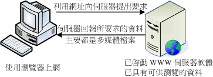
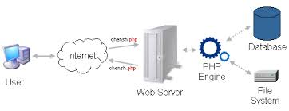

### 第六章 PHP 基本語法
#### PHP 基本觀念
+ 站台的運作方式
  + 靜態網站
    
    + 取自「鳥哥的私房菜」
  + 動態網站
    
    + 取自「鳥哥的私房菜」

+ PHP 的運作方式
  + PHP Engine
    

#### 變數與資料型態
#### 運算子
#### 參考文獻
+ [鳥哥的私房菜](http://dic.vbird.tw/linux_server/unit10.php)